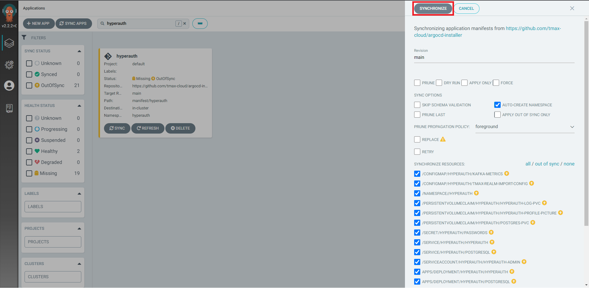
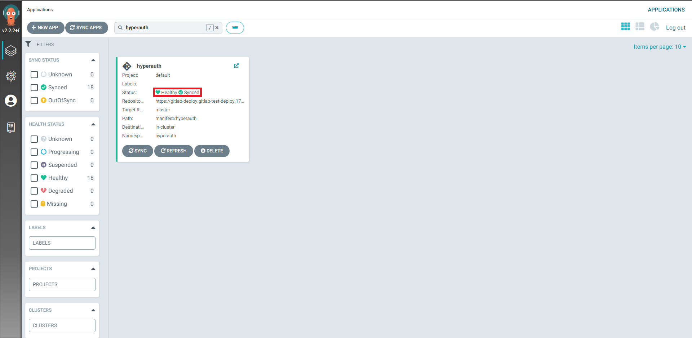

# Guide for Users
### ArgoCD를 이용한 resource 배포
1. prerequsites
    - argocd([Install guide link](https://github.com/tmax-cloud/install-argocd))
---
1. application 변수 셋팅
    - 테스트할 환경에서 바라볼 git repo url, branch,  network_disabled(true/false), private_registry를 설정
    - yq가 사용 가능한 경우
    ```
    $ ./set-env-yq.sh {{ git repo url }} {{ branch }} {{ network_disabled }} {{ private registry}}
    ```
    - yq가 사용 불가능한 경우
    - 변수명등에 의해서 오작동여부가 존재하므로 yq를 사용할 수 있도록 셋팅하는것을 추천
    ```
    $ ./set-env-yq.sh {{ git repo url }} {{ branch }} {{ network_disabled }} {{ private registry}}
    ```
    - gitlab의 경우 git repo url 마지막에 .git을 추가해주어야함  
      ex) https://gitlab.com/argocd.git
---
2. application 등록
    - 테스트할 환경에 application을 등록
    ```
    $ cd application
    $ kubectl -n {{ argocd ns }} apply -f .
    ```
    - {{ argocd ns }} 부분을 해당 환경의 argocd 네임스페이스로 치환
---
3. resource 배포(application sync)
    - application sync 순서는 [docs/install-order.md](docs/install-oerder.md)를 참조
    - 순서에 맞춰서 모듈을 sync
    - sync 방식은 아래와 같음
    1) argocd server에 접속후 로그인
        - argocd server 주소는 다음과 같이 알 수 있음
            ```
            $ kubectl get svc -n {{ argocd ns }} argocd-server
            ```
            
    
    2) application sync
        - sync하고자 하는 application을 찾아서 sync 버튼을 클릭  
        

        - option 및 sync target을 설정하고 synchronize 버튼 클릭
        

    3) sync status 확인
        - sync status(health check, sync check)를 확인
        

        - app card를 누르면 리소스별 status 체크 가능
        